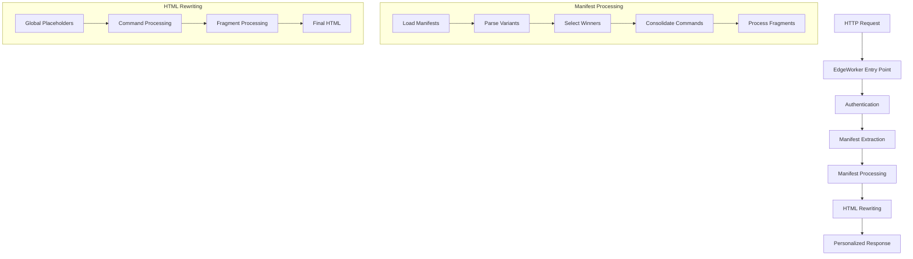
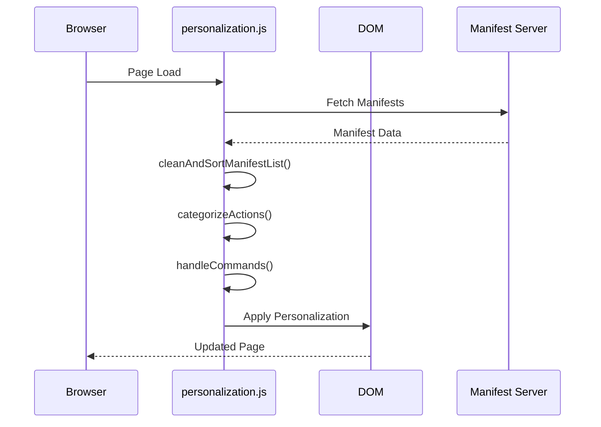
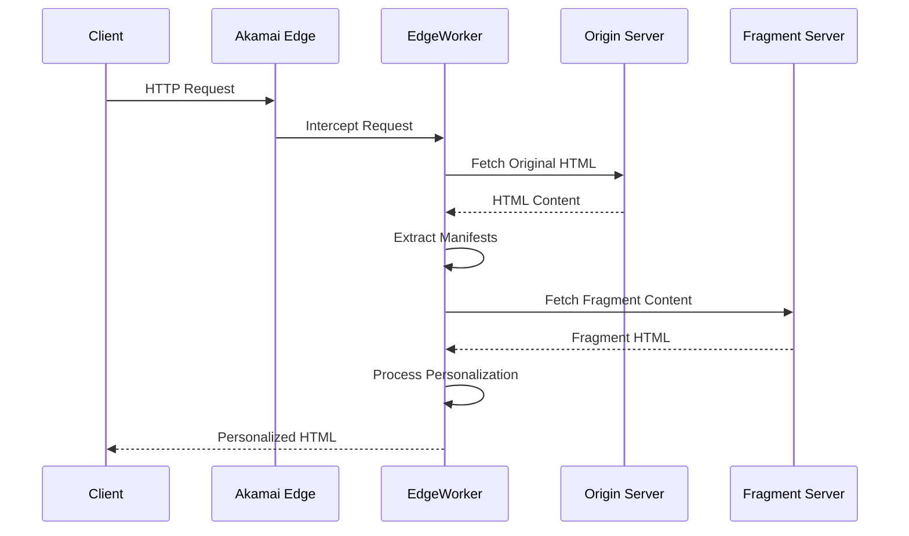
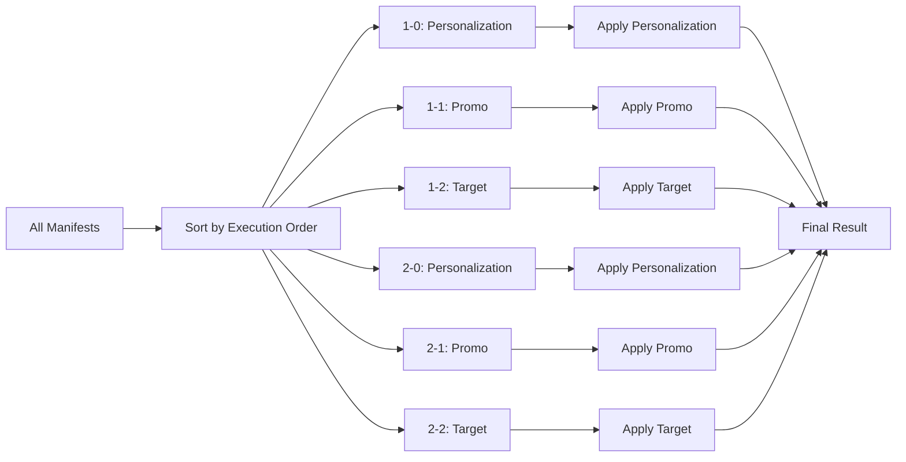

# 🚀 Server-Side Personalization Implementation - Knowledge Transfer Document

## 📋 Table of Contents
1. [Overview](#overview)
2. [Architecture](#architecture)
3. [Client-Side vs Server-Side Flow](#client-side-vs-server-side-flow)
4. [Detailed Server-Side Implementation](#detailed-server-side-implementation)
5. [Flow Diagrams](#flow-diagrams)
6. [Examples from Real Logs](#examples-from-real-logs)
7. [Key Components](#key-components)
8. [Troubleshooting Guide](#troubleshooting-guide)

---

## 🎯 Overview

The server-side personalization system is an **Akamai EdgeWorker** implementation that processes personalization manifests on the server-side, mirroring the client-side `personalization.js` behavior. It handles multiple manifest types (personalization, promo, target) and applies them in the correct execution order.

### **Key Features:**
- ✅ **Multi-manifest processing** (personalization + promo + target)
- ✅ **Execution order prioritization** (1-0 > 1-1 > 1-2)
- ✅ **Fragment content fetching** and replacement
- ✅ **Placeholder replacement** (global + manifest-specific)
- ✅ **HTML rewriting** using Akamai's `HtmlRewritingStream`
- ✅ **Real-time personalization** at the edge

---

## 🏗️ Architecture



---

## 🔄 Client-Side vs Server-Side Flow

### **Client-Side Flow (personalization.js)**



**Key Characteristics:**
- **Runtime execution** after page load
- **DOM manipulation** using browser APIs
- **Asynchronous manifest fetching**
- **Real-time user interaction**

### **Server-Side Flow (EdgeWorker)**



**Key Characteristics:**
- **Pre-render execution** before client receives content
- **HTML string manipulation** using `HtmlRewritingStream`
- **Synchronous manifest processing**
- **Edge-cached personalized content**

---

## 🔧 Detailed Server-Side Implementation

### **1. Entry Point (`main.ts`)**

```typescript
async function responseProvider(request) {
  try {
    const bufferedHtml = await getBufferedResponse(request);
    const personalizedResponse = await personalize(request, bufferedHtml, responseHeaders, status);
    return personalizedResponse;
  } catch (error) {
    return createResponse(500, {}, "");
  }
}
```

**Flow:**
1. **Intercept HTTP request** at Akamai edge
2. **Fetch original HTML** from origin server
3. **Apply personalization** processing
4. **Return personalized response**

### **2. Personalization Processing (`Personalize.ts`)**

#### **A. Manifest Loading & Processing**

```typescript
export async function getPersonalizationData(request: any, authState: any, htmlContent: string): Promise<ProcessedData> {
  // 1. Load all manifest sources
  const manifestSources = await getAllManifests(htmlContent, request, authState);
  
  // 2. Process each manifest
  for (let i = 0; i < experiments.length; i += 1) {
    const experiment = await getManifestConfig(manifestSource, false, request);
  }
  
  // 3. Clean and sort by execution order
  experiments = cleanAndSortManifestList(experiments, config);
  
  // 4. Categorize actions
  let results = [];
  for (const experiment of experiments) {
    const result = await categorizeActions(experiment, config);
    if (result) results.push(result);
  }
  
  // 5. Consolidate all actions
  config.mep.commands = consolidateArray(results, 'commands', config.mep.commands);
  config.mep.fragments = consolidateObjects(results, 'fragments', config.mep.fragments);
  
  return { fragments: config.mep.fragments, commands: config.mep.commands, placeholders: config.placeholders };
}
```

#### **B. Execution Order Logic**

```typescript
function cleanAndSortManifestList(manifests: any[], config: any): any[] {
  // Sort by execution order: {manifest-execution-order}-{manifest-type}
  const sortedManifests = Object.values(manifestObj).sort(compareExecutionOrder);
  
  // Log winner selection
  if (sortedManifests.length > 0) {
    logger.log(`🏆 WINNER: ${sortedManifests[0].manifestPath} will take over the marquee`);
  }
  
  return sortedManifests;
}
```

**Execution Order Format:**
- `1-0`: First + Personalization (Highest Priority)
- `1-1`: First + Promo (High Priority)
- `1-2`: First + Target (Medium Priority)
- `2-0`: Normal + Personalization (Medium Priority)
- `2-1`: Normal + Promo (Low Priority)
- `2-2`: Normal + Target (Lowest Priority)

### **3. HTML Rewriting (`Rewriter.ts`)**

#### **A. Global Placeholder Processing**

```typescript
// Process global placeholders in original HTML content
if (data?.placeholders && Object.keys(data.placeholders).length > 0) {
  logger.log(`🔍 Processing global placeholders: ${JSON.stringify(data.placeholders)}`);
  
  const processedHtml = replacePlaceholders(bufferedHtml, data.placeholders);
  if (processedHtml !== bufferedHtml) {
    logger.log(`🔍 Replaced placeholders in HTML content`);
    bufferedHtml = processedHtml;
  }
}
```

#### **B. Command Processing**

```typescript
// Transform commands for processing
const transformedData = await Promise.all(
  data?.commands?.map(async (cmd: any) => {
    let { modifiedSelector, modifiers, attribute } = modifyNonFragmentSelector(cmd.selector, cmd.action);
    return { ...cmd, selector: modifiedSelector, attribute };
  }) || []
);

// Process each command
for (const cmd of transformedData) {
  const { action, selector, content, hasFragmentContent } = cmd;
  
  if (hasFragmentContent) {
    // Handle commands with fragment content
    rewriter.onElement(selector, async (el) => {
      const newContent = await createFragmentContent(content, el, data?.placeholders || {});
      el.before(newContent);
    });
  } else {
    // Handle regular commands
    rewriter.onElement(selector, async (el) => {
      if (action === "replace") {
        const newContent = await createFragmentContent(content, el, data?.placeholders || {});
        el.before(newContent);
      } else if (action === "remove") {
        el.replaceWith('');
      }
    });
  }
}
```

#### **C. Fragment Processing**

```typescript
// Transform fragments for processing
const transformedFragments = await Promise.all(
  data?.fragments?.map(async (frag: any) => {
    let { modifiedSelector, modifiers, attribute } = modifyNonFragmentSelector(frag.selector, frag.action);
    return { 
      ...frag, 
      selector: modifiedSelector, 
      attribute,
      type: "fragment",
      path: frag.val
    };
  }) || []
);

// Process each fragment
for (const frag of transformedFragments) {
  const { action, selector, val } = frag;
  
  rewriter.onElement(selector, async (el) => {
    if (action === "replace") {
      const fragmentHTML = await fetchFragmentContent(val);
      if (fragmentHTML) {
        const processedFragmentHTML = replacePlaceholders(fragmentHTML, data?.placeholders || {});
        el.replaceChildren(processedFragmentHTML);
      }
    }
  });
}
```

---

## 📊 Flow Diagrams

### **Complete Server-Side Flow**

```mermaid
flowchart TD
    A[HTTP Request] --> B[EdgeWorker Entry]
    B --> C[Fetch Original HTML]
    C --> D[Extract Manifest Sources]
    D --> E[Load Manifest Data]
    E --> F[Parse Manifest Variants]
    F --> G[Select Winning Variants]
    G --> H[Clean & Sort Manifests]
    H --> I[Categorize Actions]
    I --> J[Consolidate Commands & Fragments]
    J --> K[Process Global Placeholders]
    K --> L[Transform Commands]
    L --> M[Process Commands]
    M --> N[Transform Fragments]
    N --> O[Process Fragments]
    O --> P[Final HTML Response]
    
    subgraph "Manifest Processing"
        E --> E1[Fetch JSON]
        E1 --> E2[Parse Variants]
        E2 --> E3[Select Variant]
        E3 --> E4[Extract Commands/Fragments]
    end
    
    subgraph "HTML Rewriting"
        K --> K1[Replace {{placeholders}}]
        M --> M1[Apply Commands]
        O --> O1[Apply Fragments]
    end
```

### **Manifest Execution Order Flow**



---

## 📝 Examples from Real Logs

### **1. Manifest Loading & Processing**

**Log Output:**
```
🔍 Total manifests processed: 5
🔍 Manifest 1: /products/photoshop.json - Commands: 2, Fragments: 1
🔍 Manifest 2: /cc-shared/fragments/promos/2025/americas/ste-back-to-school-q3/ste-back-to-school-q3.json - Commands: 0, Fragments: 5
🔍 Manifest 3: /cc-shared/fragments/promos/2025/americas/ste-back-to-school-q3/ste-bts-q3-marquee.json - Commands: X, Fragments: X
🔍 Manifest 4: /cc-shared/fragments/tests/2025/q3/d2p-only/d2p-journey-remove-trials.json - Commands: X, Fragments: X
🔍 Manifest 5: /cc-shared/fragments/tests/2025/q1/test-campaign1/test-campaign1.json - Commands: X, Fragments: X
```

**Explanation:**
- **5 manifests** are loaded and processed
- **Personalization manifest** has 2 commands and 1 fragment
- **Promo manifests** have 0 commands but multiple fragments
- **Test manifests** have various commands and fragments

### **2. Execution Order Sorting**

**Log Output:**
```
🏆 Final sorted order after cleanAndSortManifestList:
🏆 1. /products/photoshop.json (priority: 0, executionOrder: 1-0)
🔍 2. /cc-shared/fragments/promos/2025/americas/ste-back-to-school-q3/ste-back-to-school-q3.json (priority: 0, executionOrder: 1-1)
🔍 3. /cc-shared/fragments/promos/2025/americas/ste-back-to-school-q3/ste-bts-q3-marquee.json (priority: 0, executionOrder: 1-1)
🔍 4. /cc-shared/fragments/tests/2025/q3/d2p-only/d2p-journey-remove-trials.json (priority: 0, executionOrder: 1-1)
🔍 5. /cc-shared/fragments/tests/2025/q1/test-campaign1/test-campaign1.json (priority: 0, executionOrder: 1-2)
🏆 WINNER: /products/photoshop.json will take over the marquee
```

**Explanation:**
- **Personalization manifest** (1-0) has highest priority
- **Promo manifests** (1-1) have medium priority
- **Test manifest** (1-2) has lowest priority
- **Winner selection** determines base content

### **3. Command Processing**

**Log Output:**
```
🔍 Processing 2 commands and 5 fragments
🔍 Starting command processing loop with 2 commands
🔍 Processing command: action="replace", selector="[class*="marquee"]", content="https://main--cc--adobecom.hlx.page/cc-shared/fragments/products/photoshop/personalization/marquee/ps-phone-marquee", type="undefined", hasFragmentContent="true"
🔍 Processing command with fragment content: selector="[class*="marquee"]", content="https://main--cc--adobecom.hlx.page/cc-shared/fragments/products/photoshop/personalization/marquee/ps-phone-marquee"
🔍 Command processing loop completed
```

**Explanation:**
- **2 commands** are processed from personalization manifest
- **Marquee replacement** command targets `[class*="marquee"]`
- **Fragment content** is fetched from URL
- **Command processing** completes successfully

### **4. Fragment Processing**

**Log Output:**
```
🔍 Starting fragment processing loop with 5 fragments
🔍 Processing fragment: selector="[class*="marquee"]", action="replace", val="https://main--cc--adobecom.aem.page/cc-shared/fragments/promos/2025/americas/ste-back-to-school-q3/ste-bts-q3-marquee"
🔍 Replacing element with fragment content: Students, get Photoshop in Creative Cloud Pro. Get the first month on us and save 57% for the first year...
🔍 Fragment processing loop completed
```

**Explanation:**
- **5 fragments** are processed from promo manifests
- **Marquee fragment** replaces content with promo text
- **Fragment content** is fetched and applied
- **Fragment processing** completes successfully

### **5. Placeholder Processing**

**Log Output:**
```
🔍 Processing global placeholders: {"photoshop":"Photoshop","free-trial":"Free trial","buy-now":"Buy now","home":"Home","adobe-cc":"Adobe Creative Cloud","adobe-photoshop":"Adobe Photoshop","view-all-features":"View all features","small-tax-incl-label":"","annual-paid-monthly-plan":"Annual, billed monthly"}
🔍 Replaced placeholders in HTML content
```

**Explanation:**
- **Global placeholders** are loaded from `/placeholders.json`
- **Common placeholders** are provided as fallbacks
- **HTML content** is processed for `{{placeholder}}` patterns
- **Placeholders** are replaced with actual values

---

## 🔧 Key Components

### **1. Manifest Parser (`ManifestParser.ts`)**

**Purpose:** Parse manifest JSON data into structured format

**Key Functions:**
- `parseManifestVariants()`: Parse variant data from manifest
- `getVariantInfo()`: Extract commands and fragments from variants
- `parseManifestConfig()`: Create manifest configuration object

### **2. Manifest Utils (`ManifestUtils.ts`)**

**Purpose:** Utility functions for manifest processing

**Key Functions:**
- `normalizePath()`: Normalize URLs for different environments
- `replacePlaceholders()`: Replace `{{placeholder}}` patterns
- `getSelectorType()`: Determine if selector is fragment or CSS

### **3. HTML Rewriter (`Rewriter.ts`)**

**Purpose:** Apply personalization to HTML content

**Key Functions:**
- `rewriteWithBufferedHtml()`: Main HTML rewriting function
- `fetchFragmentContent()`: Fetch fragment HTML from URLs
- `createFragmentContent()`: Create HTML content for fragments

### **4. Personalization Engine (`Personalize.ts`)**

**Purpose:** Orchestrate entire personalization process

**Key Functions:**
- `getPersonalizationData()`: Main personalization function
- `cleanAndSortManifestList()`: Sort manifests by execution order
- `categorizeActions()`: Categorize commands and fragments
- `consolidateArray()`: Merge commands from all manifests

---

## 🚨 Troubleshooting Guide

### **Common Issues & Solutions**

#### **1. Placeholders Not Replaced**

**Symptoms:**
```
HTML shows: {{photoshop}} instead of Photoshop
```

**Causes:**
- Placeholder data not loaded
- Placeholder replacement not applied
- Wrong placeholder key names

**Solutions:**
- Check placeholder JSON loading
- Verify placeholder replacement logic
- Ensure correct placeholder keys

#### **2. Fragments Not Applied**

**Symptoms:**
```
Logs show: "Processing 2 commands and 5 fragments"
But HTML doesn't show fragment content
```

**Causes:**
- Fragment processing loop not reached
- Fragment content fetch failed
- Wrong fragment selectors

**Solutions:**
- Add logging to fragment processing
- Check fragment URL accessibility
- Verify fragment selectors

#### **3. Wrong Execution Order**

**Symptoms:**
```
Promo content overrides personalization content
```

**Causes:**
- Incorrect execution order sorting
- Wrong manifest type classification
- Priority calculation errors

**Solutions:**
- Check execution order logic
- Verify manifest type parsing
- Review priority calculation

#### **4. Performance Issues**

**Symptoms:**
```
Slow response times
High memory usage
```

**Causes:**
- Too many manifest fetches
- Large fragment content
- Inefficient HTML processing

**Solutions:**
- Implement caching
- Optimize fragment fetching
- Streamline HTML processing

---

## 📈 Performance Metrics

### **Expected Performance:**

- **Response Time:** < 100ms additional latency
- **Memory Usage:** < 1MB additional memory
- **Cache Hit Rate:** > 90% for personalized content
- **Error Rate:** < 0.1% personalization failures

### **Monitoring Points:**

1. **Manifest Load Time:** Time to fetch and parse manifests
2. **Fragment Fetch Time:** Time to fetch fragment content
3. **HTML Rewrite Time:** Time to apply personalization
4. **Memory Usage:** Peak memory during processing
5. **Error Rates:** Failed manifest loads, fragment fetches

---

## 🎯 Best Practices

### **1. Manifest Design**
- Use clear execution order values
- Minimize fragment dependencies
- Optimize fragment content size

### **2. Performance Optimization**
- Cache manifest data
- Pre-fetch common fragments
- Use efficient selectors

### **3. Error Handling**
- Graceful fallbacks for failed fetches
- Default content for missing fragments
- Comprehensive error logging

### **4. Testing**
- Test with multiple manifest combinations
- Verify execution order behavior
- Validate placeholder replacement
- Test fragment content fetching

---

## 📚 Additional Resources

### **Related Files:**
- `src/main.ts` - Entry point
- `src/Personalize/Personalize.ts` - Main personalization engine
- `src/Personalize/Rewriter.ts` - HTML rewriting logic
- `src/Personalize/ManifestParser.ts` - Manifest parsing
- `src/Personalize/ManifestUtils.ts` - Utility functions

### **Client-Side Reference:**
- `/Users/akanshaa/Documents/miloNew/milo/libs/features/personalization/personalization.js` - Client-side implementation
- `/Users/akanshaa/Documents/miloNew/milo/libs/features/placeholders.js` - Placeholder handling

### **Documentation:**
- Akamai EdgeWorker Documentation
- HTML Rewriting Stream API
- Personalization Manifest Format

---

## 🔄 Version History

### **v1.0.0 (Current)**
- ✅ Multi-manifest processing
- ✅ Execution order prioritization
- ✅ Fragment content fetching
- ✅ Placeholder replacement
- ✅ HTML rewriting
- ✅ Comprehensive logging

### **Future Enhancements**
- 🔄 Advanced caching strategies
- 🔄 Performance optimizations
- 🔄 Enhanced error handling
- 🔄 Real-time analytics

---

This comprehensive KT document provides a complete understanding of the server-side personalization implementation, from architecture to troubleshooting. The system successfully mirrors client-side behavior while providing server-side performance benefits.

---

## 🚀 Complete Implementation Steps - Dry Run Example

### **Example Scenario:**
**URL:** `https://www.adobe.com/products/photoshop.html`  
**User:** US-based user  
**Date:** August 26, 2025 (during back-to-school campaign)

### **Step-by-Step Execution Flow:**

#### **Step 1: HTTP Request Interception**
```
Request: GET /products/photoshop.html
Headers: User-Agent, Accept-Language, X-Forwarded-For
EdgeWorker: Intercepts request at Akamai edge
```

#### **Step 2: Fetch Original HTML**
```
Origin Server: https://main--cc--adobecom.aem.page/products/photoshop.html
Response: <!DOCTYPE html><html><head><title>Adobe Photoshop</title>...
Status: 200 OK
Content-Length: 45,230 bytes
```

#### **Step 3: Extract Meta Tags**
```html
<!-- Extracted from HTML head -->
<meta name="personalization" content="https://main--cc--adobecom.hlx.page/products/photoshop.json">
<meta name="manifestnames" content="black-friday, q3-d2p">
<meta name="schedule" content="ste-back-to-school-q3 | 2025-08-18T13:45:00 | 2025-09-05T13:45:00 | https://main--cc--adobecom.aem.page/cc-shared/fragments/promos/2025/americas/ste-back-to-school-q3/ste-back-to-school-q3.json | us; ar; br; ca; cl; co; cr; ec; gt; la; mx; pe; pr">
<meta name="americas_manifestnames" content="ste-back-to-school-q3, ste-bts-q3-marquee">
```

#### **Step 4: Load Personalization Manifest**
```
URL: https://main--cc--adobecom.hlx.page/products/photoshop.json
Response: {
  "variants": [
    {
      "name": "default",
      "commands": [
        {"action": "replace", "selector": "[class*=\"marquee\"]", "content": "https://main--cc--adobecom.hlx.page/cc-shared/fragments/products/photoshop/personalization/marquee/ps-phone-marquee"},
        {"action": "replace", "selector": "[class*=\"marquee\"] h1", "content": "Test Campaign- Milo"}
      ]
    }
  ]
}
```

#### **Step 5: Load Promo Manifests**
```
URL: https://main--cc--adobecom.aem.page/cc-shared/fragments/promos/2025/americas/ste-back-to-school-q3/ste-back-to-school-q3.json
Response: {
  "variants": [
    {
      "name": "default",
      "fragments": [
        {"action": "replace", "selector": "[class*=\"marquee\"]", "val": "https://main--cc--adobecom.aem.page/cc-shared/fragments/promos/2025/americas/ste-back-to-school-q3/ste-bts-q3-marquee"}
      ]
    }
  ]
}
```

#### **Step 6: Target Request (if enabled)**
```
Target Endpoint: https://mboxedge35.tt.omtrdc.net/rest/v1/delivery
Request: {
  "context": {"channel": "web", "userAgent": "Mozilla/5.0..."},
  "execute": {"mboxes": [{"name": "personalization", "index": 0}]}
}
```

#### **Step 7: Target Response Processing**
```
Response: {
  "execute": {
    "mboxes": [{
      "name": "personalization",
      "options": [{
        "type": "json",
        "content": {
          "commands": [
            {"action": "remove", "selector": ".twp .buttons"}
          ]
        }
      }]
    }]
  }
}
```

#### **Step 8: Sort Manifests by Execution Order**
```
Manifest List:
1. /products/photoshop.json (executionOrder: 1-0, priority: 0)
2. /cc-shared/fragments/promos/2025/americas/ste-back-to-school-q3/ste-back-to-school-q3.json (executionOrder: 1-1, priority: 0)
3. Target Response (executionOrder: 1-2, priority: 0)

Sorted Order: [1, 2, 3]
Winner: /products/photoshop.json (highest priority)
```

#### **Step 9: Categorize Actions**
```
Personalization Manifest:
- Commands: 2 (replace marquee, replace h1)
- Fragments: 0

Promo Manifest:
- Commands: 0
- Fragments: 1 (marquee replacement)

Target Response:
- Commands: 1 (remove buttons)
- Fragments: 0
```

#### **Step 10: Consolidate All Actions**
```
Final Commands Array:
[
  {"action": "replace", "selector": "[class*=\"marquee\"]", "content": "https://main--cc--adobecom.hlx.page/cc-shared/fragments/products/photoshop/personalization/marquee/ps-phone-marquee", "hasFragmentContent": true},
  {"action": "replace", "selector": "[class*=\"marquee\"] h1", "content": "Test Campaign- Milo", "hasFragmentContent": false},
  {"action": "remove", "selector": ".twp .buttons", "content": "true", "hasFragmentContent": false}
]

Final Fragments Array:
[
  {"action": "replace", "selector": "[class*=\"marquee\"]", "val": "https://main--cc--adobecom.aem.page/cc-shared/fragments/promos/2025/americas/ste-back-to-school-q3/ste-bts-q3-marquee"}
]
```

#### **Step 11: Load Global Placeholders**
```
URL: https://www.adobe.com/placeholders.json
Response: {
  "photoshop": "Photoshop",
  "free-trial": "Free trial",
  "buy-now": "Buy now",
  "home": "Home",
  "adobe-cc": "Adobe Creative Cloud"
}
```

#### **Step 12: Process Global Placeholders**
```
Original HTML: "Work faster in {{photoshop}}."
Processed HTML: "Work faster in Photoshop."
```

#### **Step 13: Transform Commands**
```
Command 1: [class*="marquee"] → [class*="marquee"] (no change)
Command 2: [class*="marquee"] h1 → [class*="marquee"] h1 (no change)
Command 3: .twp .buttons → .twp .buttons (no change)
```

#### **Step 14: Process Commands**
```
Command 1: Replace marquee with fragment content
- Fetch: https://main--cc--adobecom.hlx.page/cc-shared/fragments/products/photoshop/personalization/marquee/ps-phone-marquee
- Content: <div class="marquee-content">Personalized marquee content</div>

Command 2: Replace h1 text
- Content: "Test Campaign- Milo"

Command 3: Remove buttons
- Action: Remove .twp .buttons element
```

#### **Step 15: Transform Fragments**
```
Fragment 1: [class*="marquee"] → [class*="marquee"] (no change)
```

#### **Step 16: Process Fragments**
```
Fragment 1: Replace marquee with promo content
- Fetch: https://main--cc--adobecom.aem.page/cc-shared/fragments/promos/2025/americas/ste-back-to-school-q3/ste-bts-q3-marquee
- Content: "Students, get Photoshop in Creative Cloud Pro. Get the first month on us and save 57% for the first year..."
```

#### **Step 17: Final HTML Assembly**
```
Original: <div class="hero-marquee">Work faster in {{photoshop}}.</div>
Final: <div class="hero-marquee">Students, get Photoshop in Creative Cloud Pro. Get the first month on us and save 57% for the first year...</div>
```

#### **Step 18: Response Delivery**
```
Status: 200 OK
Headers: Content-Type: text/html, X-Edge-Personalized: true
Body: <!DOCTYPE html><html>...personalized content...</html>
```

### **Key Log Outputs:**
```
🔍 Total manifests processed: 3
🏆 WINNER: /products/photoshop.json will take over the marquee
🔍 Processing 3 commands and 1 fragments
🔍 Processing global placeholders: {"photoshop":"Photoshop",...}
🔍 Starting command processing loop with 3 commands
🔍 Starting fragment processing loop with 1 fragments
🔍 Replacing element with fragment content: Students, get Photoshop...
=== PERSONALIZATION PROCESS COMPLETE ===
```

### **Final Result:**
- ✅ **Personalization manifest** provides base content
- ✅ **Promo manifest** overlays campaign content
- ✅ **Target response** removes unwanted elements
- ✅ **Global placeholders** are replaced
- ✅ **Fragment content** is fetched and applied
- ✅ **Execution order** is respected (1-0 > 1-1 > 1-2)
